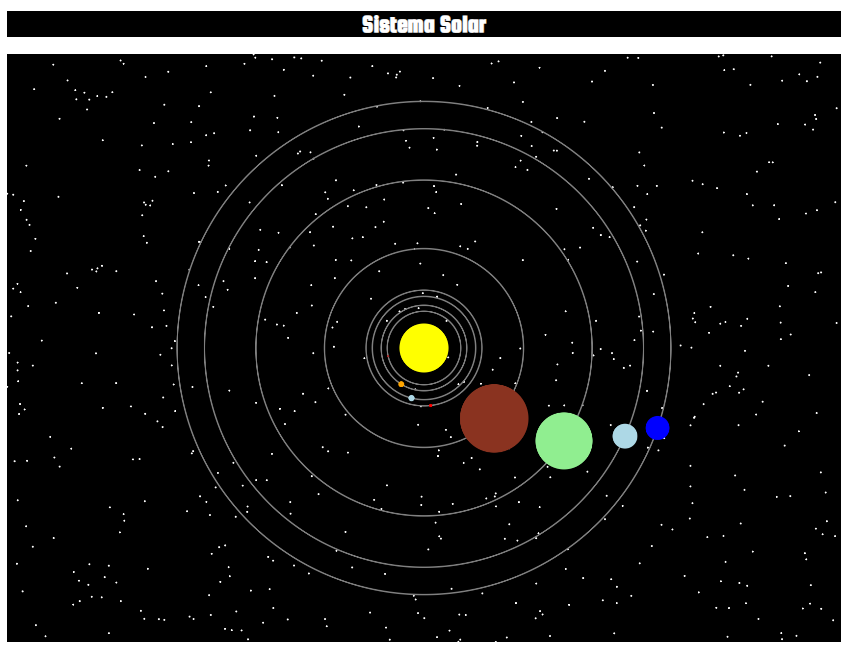

# Solar System Animation Project

This project is an animated simulation of the solar system created using HTML and JavaScript, with planets orbiting the Sun based on their relative sizes and speeds. The animation includes a dynamic background of stars and interactive planet movements, providing a visual representation of the solar system's orbital mechanics.

## Project Overview

The project simulates the solar system's planets orbiting around the Sun with the correct relative sizes and speeds. It uses the `canvas` element and the 2D rendering context (`canvas.getContext('2d')`) to draw and animate celestial objects. Stars are randomly placed across the canvas to give a space-like background effect.

## How to Run the Project

### Requirements

To run this project, all you need is a web browser. The project is fully implemented using HTML and JavaScript, so no external libraries are required.

### Steps

1. Clone or download the project files into a local directory.
2. Open the `index.html` file in your browser.
3. The solar system simulation will start automatically, displaying the planets orbiting the Sun along with a starry background.

### Code Structure

The main elements of the project include:

- **Estrella class**: This class is responsible for generating star objects that are randomly positioned across the canvas.
- **Planeta class**: This class handles the creation, drawing, and movement of planet objects. Each planet is defined with properties such as radius, color, and orbital speed.
- **Animation Function**: The `animacion()` function continuously updates the positions of the planets and the background, creating the illusion of planetary orbits.
- **Orbital Parameters**: The project defines each planet's radius and speed based on real-world data, ensuring that their movements are proportionally accurate.

### Features

- **Planets with Orbital Motion**: The planets orbit the Sun at different speeds based on their relative distances and orbital periods.
- **Relative Planet Sizes**: The planets' sizes are scaled according to their actual diameters, providing a realistic comparison.
- **Star Background**: Hundreds of randomly generated stars are placed in the background to simulate outer space.
- **Smooth Animation**: The animation is achieved using the `requestAnimationFrame` method, ensuring smooth and efficient rendering of the planetary motions.

### Planetary Data

The planets' sizes and orbital speeds are based on NASA's data on the relative sizes and orbital velocities of the planets in the solar system:

- **Mercury**: Diameter of 2,439.7 km, orbital speed 47.87 km/s.
- **Venus**: Diameter of 6,051.8 km, orbital speed 35.02 km/s.
- **Earth**: Diameter of 6,371 km, orbital speed 29.78 km/s.
- **Mars**: Diameter of 3,389.5 km, orbital speed 24.07 km/s.
- **Jupiter**: Diameter of 69,911 km, orbital speed 13.07 km/s.
- **Saturn**: Diameter of 58,232 km, orbital speed 9.69 km/s.
- **Uranus**: Diameter of 25,362 km, orbital speed 6.81 km/s.
- **Neptune**: Diameter of 24,397 km, orbital speed 5.43 km/s.

### Customization

You can easily add new features or customize the project:

- **Add More Celestial Bodies**: You can add moons or comets by creating new objects using the `Planeta` class.
- **Adjust Colors**: The planet's colors can be customized by changing the `fillStyle` property in the `Planeta` class.
